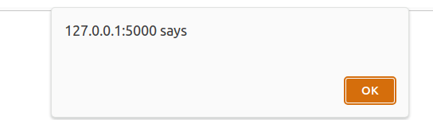
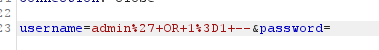
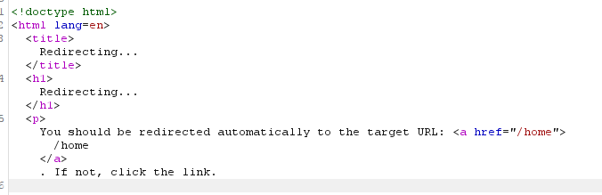

# app_with_vulnerabilities

## Инструкция по сборке и запуску приложения

Для сборки и запуска приложения выполните следующие команды:

```bash
docker build -t app_with_vulns .
docker run -p 5000:5000 app_with_vulns
```
## Ниже будут представлены Proof of concepts для уязвимостей, которые содержатся в этом приложении.

### POC для XXS (Cross-Site Scripting) уязвимости:
   В данном веб приложении содержится STORED XXS уязвимость. Именно на странице отзывов: если злоумышленник оставит отзыв с вредоносной нагрузкой (например java script, который крадет cookie пользователя и отправляет их на сервер злоумышленника, то этот комментарий сохранится в БД, после чего будет происходить следующее: когда рядовой пользователь зайдет на страницу отзывов, этот вредоносный скрипт выполнится без его ведома, злоумышленник получит cookie пользователя. (Снизу приведен скриншот, когда оставлен следующий комментарий:
   ```javascript
   <script>alert()</script>
   ```
   
   Возникает эта уязвимости из-за следующего: пользовательский ввод никак не обрабатывается, не экранируется.

### POC для IDOR (Insecure Direct Object Reference)
   Злоумышленник переходит на страницу просмотра обложки книги, видит в строке браузера, например, следующий запрос:
   ```
   view_cover?cover_path=uploads/looking_for_alaska.jpg
   ```
   Далее он может попытаться угадать название файла какой-то другой обложки книги (или он может знать, что точно есть такая обложка с таким названием), к которой у него нет доступа, попытаться выполнить следующий запрос: 
   ```
   view_cover?cover_path=uploads/secret_cover.jpg
   ```
   

   Импакт этой уязвимости следующий: злоумышленник может получить доступ к каким-то Sensitive данным сервера, или конфиденциальной информации другого пользователя. Возникает эта уязвимость из-за того, что приложение не проверяет должным образом имеет ли доступ к этому файлу пользователь.

### POC для SQLI (SQL inejction)
   Если ввести в поле ввода логина следующую полезну нагрузку:
   ```
   qwertyasd' OR 1=1 -
   ```
   Если мы не знаем конкретного username пользователя, а пользователя с username "qwertyasd" не существует, мы получим доступ за первого доступного пользователя из таблицы.
    
   ```
   testuser' --
   ```
   Такой пейлод поможет нам, если мы знаем конкретного пользователя с username "testuser".
   
   
   
   
   Как можно видеть, мы успешно вошли.
   Также можно использовать инструмент sqlmap, который позволит автоматизировать поиск SQLI в запросе, для того, чтобы сдампить базу данных, получив информацию о всех пользователях
